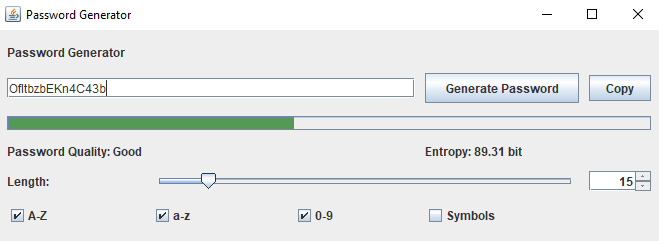

# java-password-generator

Having a strong password is crucial these days. Strong password prevents unauthorized individual to access our sensitive information. Inspired by KeepPassXC an a password manager application, I decided to make a simple password generator using Java to further develop my Java skill. 
The password generator uses Java Swing Framework to display Graphical User Interface. 

User is able to generate password with different length and combinations of characters. 
After generating the password, the password quality and entropy are shown. In additon, user can copy the generated password to clipboard by clicking the copy button.

Below is how password entropy is calculated.

$Entropy = L \log _{2} R  $

Where:

$R$ - Size of the pool of unique characters

$L$ - Password Length

| Entropy Value | Category      | 
| ------------- |:-------------:| 
| 0 - 44      | Poor |
| 45 - 74      | Weak      | 
| 75 -99 | Good     |
| >= 100  | Excellent      |

